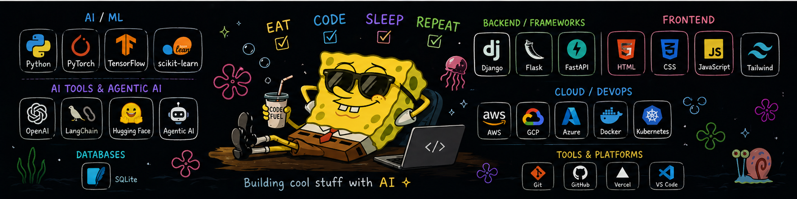

  

# 👋 Hi, I'm Daksh
### Building Agentic AI & Scalable ML Systems for Real-World Impact

  
  
  
  

## 🧠 About Me

I design and build **intelligent AI systems** that transform research into real-world impact.

- 🧠 **Focus:** Agentic AI • Multi-Agent Systems • AI/ML • UI/UX  
- ⚙️ **Core Stack:** Python • LLMs • RAG • Transformers  
- 🚀 **Currently:** Building scalable AI-powered applications  
- 🤝 **Open to:** Collaborations & innovative AI projects  

   

## 💻 Tech Stack

### 👨‍💻 Languages

### 🌐 Frontend

### ⚙️ Backend & Frameworks

### 🤖 AI / ML

### ☁️ Cloud & DevOps

### 🗄️ Databases

### 🧰 Tools

## 🚀 Featured Work

### 🧠 AI Systems (In Progress)
> Building **Agentic AI systems** and **multi-agent workflows**  
> focused on real-world automation and intelligence.

## 📊 GitHub Insights

  <table align="center">
    <tr>
      <td align="center" width="50%">
        <!-- GitHub Stats Card (Left) -->
        
      </td>
      <td align="center" width="50%">
        <!-- Top Languages Card (Right) -->
        
      </td>
    </tr>
  </table>

  

## 🏆 Achievements

  

## 💡 Quote

  

